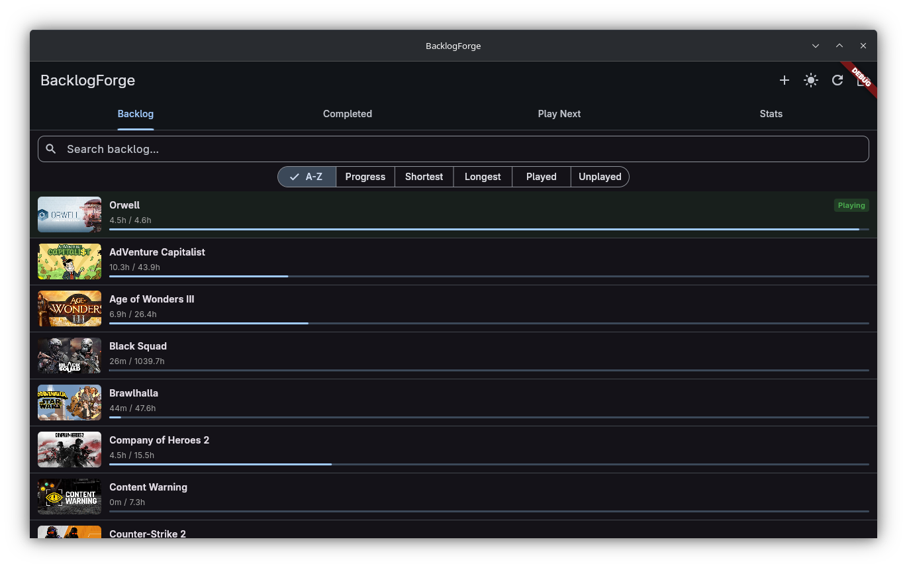
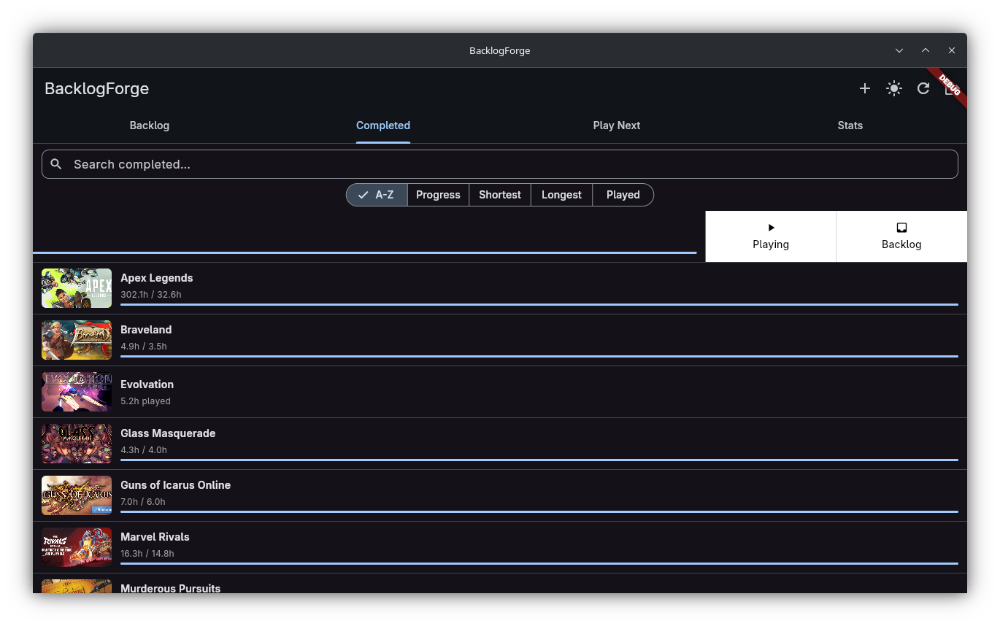
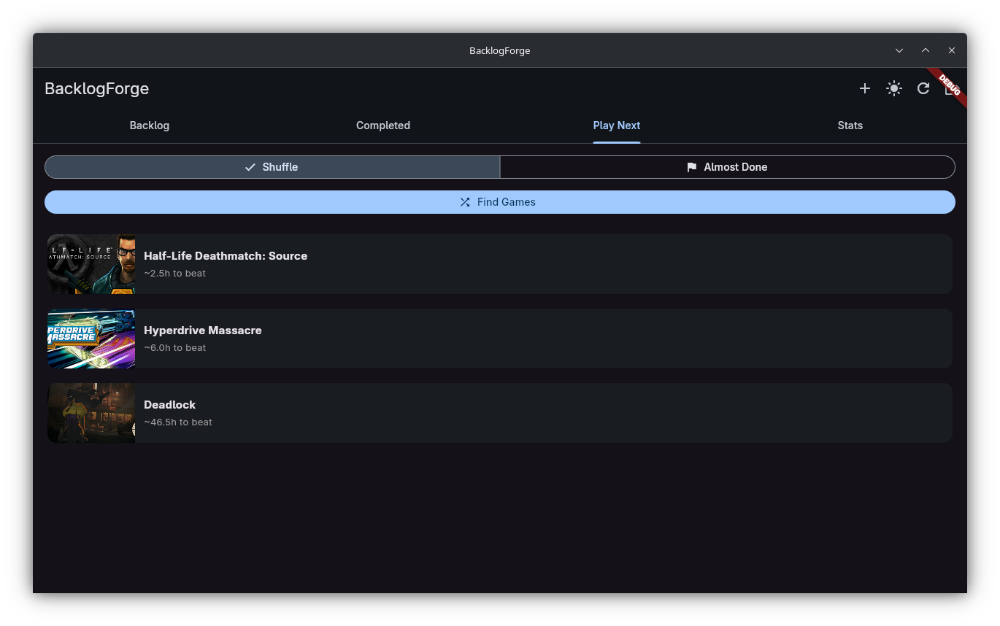
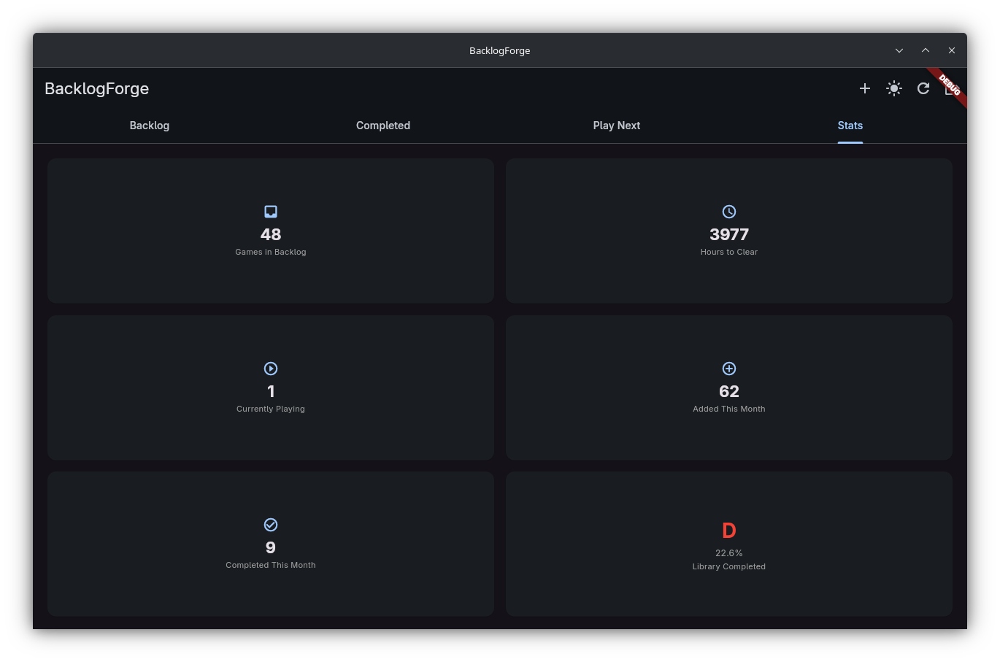

# BacklogForge

Know what to play. Actually finish it.

---

## Overview

BacklogForge connects to your Steam account, imports your game library, and helps you decide what to play next. It pulls completion time estimates from HowLongToBeat and compares them against your actual playtime to automatically track which games you have finished, which are in progress, and which are still sitting in your backlog.

The application is designed for PC gamers who own large Steam libraries and want a structured, low-friction way to manage them without relying on spreadsheets or third-party web services that do not respect your data.

---

## Screenshots










---

## Installation

### Prerequisites

- [Flutter SDK](https://docs.flutter.dev/get-started/install) 3.x or later
- Dart SDK (bundled with Flutter)
- Python 3.10 or later (only required if self-hosting the completion-time proxy)
- A Steam account with a public game library

### Clone the repository

```bash
git clone https://github.com/ajwadtahmid/backlogforge.git
cd backlogforge
```

### Install Flutter dependencies

```bash
flutter pub get
```

### Generate database code

BacklogForge uses Drift for its local database. The generated files must be built before the first run.

```bash
dart run build_runner build
```

### Backend setup

The app requires a running backend server for Steam API calls. The backend is hosted at `backlogforge.onrender.com` by default.

To self-host, deploy your own instance of `server/app.py`:

```bash
cd server
pip install -r requirements.txt
flask run
```

Then update the `_backendUrl` constant in `lib/services/steam_service.dart` and `lib/services/hltb_service.dart` to point at your backend.

---

## Usage

### Run in debug mode

```bash
flutter run
```

### Build for a specific platform

```bash
# Android
flutter build apk
flutter build appbundle

# Windows
flutter build windows

# Linux
flutter build linux
```

On first launch, sign in with your Steam account. BacklogForge will sync your library and begin fetching completion time estimates in the background. Games are sorted into four tabs: **Backlog**, **Playing**, **Completed**, and **All**.

Use the refresh button in the toolbar to re-sync with Steam at any time. Games can also be added manually through the search interface if they are not in your Steam library.

---

## Features

- **Steam library sync** — imports all games from your Steam account automatically
- **HowLongToBeat integration** — fetches main story, main plus extras, and completionist estimates for each title
- **Automatic completion detection** — marks a game as completed when your playtime meets or exceeds the target threshold
- **Configurable thresholds** — choose between essential, extended, or completionist as your personal completion target
- **Manual status override** — set any game to playing or completed regardless of playtime
- **Play Next recommendation** — surfaces the most suitable backlog title based on your preferences
- **Library statistics** — summary view of total playtime, completion rate, and backlog size
- **Manual game search** — add titles that are not in your Steam library
- **Dark and light theme** — persisted across sessions
- **Offline-first** — all data is stored locally in a SQLite database; no account or cloud sync required beyond the initial Steam import

---

## Tech Stack

| Layer | Technology |
|---|---|
| UI framework | Flutter (Dart) |
| State management | Riverpod |
| Local database | Drift (SQLite) |
| Secure storage | flutter_secure_storage |
| Completion time data | HowLongToBeat (via self-hosted proxy) |
| Proxy backend | Python, Flask, howlongtobeatpy |
| Image caching | cached_network_image |
| Platforms | Android, iOS, Windows, Linux, macOS |

---

## Environment Setup

### Steam API Key (Backend)

The backend server needs a Steam API key to fetch user game libraries. If you are self-hosting the backend:

1. Obtain a key from the [Steam Web API portal](https://steamcommunity.com/dev/apikey)
2. Set the domain to your backend URL or `localhost` for local development

**On Render (cloud deployment):**
- Go to your service dashboard
- Navigate to **Environment** → **Add Environment Variable**
- Add `STEAM_API_KEY` with your API key value
- Redeploy the service

**Locally (for development):**
- Create a `.env` file in the `server/` directory:
  ```
  STEAM_API_KEY=your_api_key_here
  ```

---

## License

BacklogForge is distributed under the [GNU General Public License v3.0](LICENSE). You are free to use, modify, and distribute this software under the terms of that license.
