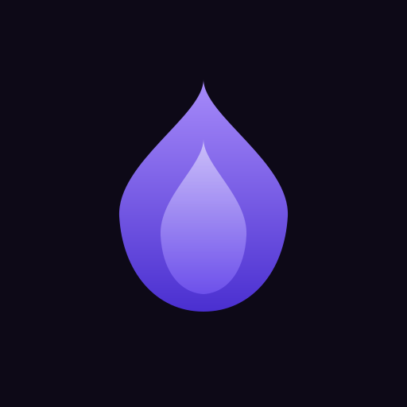

# BacklogForge

<p align="center">
  
</p>

<p align="center">
  <strong>Know what to play. Actually finish it.</strong><br/>
</p>

<p align="center">
  <a href="https://github.com/ajwadtahmid/backlogforge/releases">
    
  </a>
  <a href="https://github.com/ajwadtahmid/backlogforge/releases">
    
  </a>
  <a href="https://flutter.dev">
    
  </a>
  <a href="https://github.com/ajwadtahmid/backlogforge/blob/main/LICENSE">
    
  </a>
  
  
  
</p>

---

<div align="center">

<a href="https://github.com/ajwadtahmid/backlogforge/releases">
</a>

<a href="https://play.google.com/store/apps/details?id=com.ajwadtahmid.backlogforge">
</a>

<a href="https://apps.apple.com/app/id">
</a>

</div>

---

## Overview

BacklogForge connects to your Steam account, imports your game library, and helps you decide what to play next. It pulls completion time estimates from HowLongToBeat and compares them against your actual playtime to automatically track which games you have finished, which are in progress, and which are still sitting in your backlog.

Designed for PC gamers who own large Steam libraries and want a structured, low-friction way to manage them — no spreadsheets, no third-party accounts, all data stored locally.

## Table of Contents

- [Key Features](#key-features)
- [Screenshots](#screenshots)
- [Features](#features)
- [Downloads](#downloads)
- [Development](#development)
- [Data & Privacy](#data--privacy)
- [Support & Feedback](#support--feedback)
- [FAQ](#faq)
- [Known Limitations](#known-limitations)
- [Credits & Acknowledgments](#credits--acknowledgments)
- [License](#license)

---

### Key Features

- **Steam Library Sync** — Automatically imports your entire Steam library. BacklogForge fetches HowLongToBeat estimates for every title in the background with live sync progress, so your backlog is always up to date.

- **Automatic Completion Tracking** — Compares your actual playtime against HowLongToBeat targets to mark games as completed, in progress, or unstarted — no manual input needed. Supports Essential, Extended, and Completionist targets per game.

- **Play Next Recommendations** — Two modes to cut through decision paralysis: Shuffle picks a weighted random game from your backlog, while Homestretch surfaces games you're closest to finishing — either by percentage or fewest hours remaining.

- **Library Statistics** — A full stats dashboard with your completion grade (A+ → D-), hours remaining to clear your backlog, average finish time, monthly completion velocity, and a daily budget calculator showing how long until your backlog is clear.

- **Guest & Offline Mode** — No Steam account required. Use the app in guest mode and add games manually. All data is stored locally in SQLite with no cloud sync.

- **Per-Game Notes & Ratings** — Add personal notes and a 1–10 rating to any game. Export and import your full library (including notes and ratings) for backup or device transfer.

---

## Screenshots

| Backlog | Completed | Play Next | Stats |
|---------|-----------|-----------|-------|
|  |  |  |  |

---

## Features

- **Steam library sync** — imports all games from your Steam account automatically
- **Guest / offline mode** — use the app without a Steam account; add games manually
- **HowLongToBeat integration** — fetches Essential, Extended, and Completionist estimates per title
- **Sync progress feedback** — live counter shows HLTB fetch progress during sync
- **Automatic completion detection** — marks a game completed when playtime meets the target
- **Configurable play style** — choose Essential, Extended, or Completionist as your personal target per game
- **Manual status override** — set any game to Playing or Completed regardless of playtime
- **Play Next — Shuffle** — weighted random pick from your backlog with lockable picks
- **Play Next — Homestretch** — surface games closest to the finish line (by % or hours remaining)
- **Per-game notes & ratings** — add a 1–10 rating and freeform notes to any game
- **Finish-by projection** — estimates your finish date based on your daily gaming budget
- **Library statistics** — completion grade (A+ → D-), hours to clear backlog, avg. finish time, velocity chart
- **Daily budget calculator** — set hours per day and see when your backlog clears
- **Length filter** — filter backlog by game length (Short / Medium / Long / No Data)
- **Sort & search** — sort by playtime, HLTB estimate, alphabetically, or last played; full-text search
- **Manual game search** — add titles that are not in your Steam library
- **Background sync** — automatically re-syncs your library every 2 hours while the app is open
- **Export & import** — back up your full library (including notes, ratings, and manual games) as JSON
- **Import dry-run preview** — see exactly which games will be added or updated before confirming
- **Dark and light theme** — persisted across sessions
- **Offline-first** — all data stored locally in SQLite; no cloud sync required

---

## Development

### Requirements

| Tool | Version |
|------|---------|
| Flutter SDK | 3.x (stable channel) |
| Dart SDK | bundled with Flutter |
| Android: Java | 17 |
| Linux: GTK | `libgtk-3-dev` |

### Quick Start

```bash
# 1. Clone
git clone https://github.com/ajwadtahmid/backlogforge.git
cd backlogforge

# 2. Install dependencies
flutter pub get

# 3. Copy environment file
cp .env.example .env

# 4. Update .env with your backend URL and token
# Edit .env and set BACKEND_URL and CLIENT_TOKEN (see Configuration below)

# 5. Generate database and env code
dart run build_runner build --delete-conflicting-outputs

# 6. Run
flutter run
```

### Configuration

The app proxies Steam and HowLongToBeat requests through a private backend to keep API keys off the client.

```env
# .env
BACKEND_URL=https://your-backend-url.com
CLIENT_TOKEN=your-secret-token
```

After editing `.env`, regenerate:

```bash
dart run build_runner build --delete-conflicting-outputs
```

#### Backend

The hosted backend runs at `backlogforge.onrender.com` by default — no extra setup needed for standard use.

To self-host, deploy the server and set the following environment variables:

| Variable | Description |
|----------|-------------|
| `STEAM_API_KEY` | Steam Web API key from [steamcommunity.com/dev/apikey](https://steamcommunity.com/dev/apikey) |
| `CLIENT_TOKEN` | Shared secret matching the `CLIENT_TOKEN` in your app's `.env` |

Generate a secure token with:

```bash
python3 -c "import secrets; print(secrets.token_urlsafe(32))"
```

## Data & Privacy

- **No login, no account.** Steam ID is stored locally only; no credentials are ever sent to BacklogForge servers.
- **No analytics or tracking.** The app does not collect or send any user data.
- **Local-only storage.** All game data, notes, ratings, and settings are stored on-device in SQLite.

---

## Support & Feedback

Have a question or found a bug? Let us know:

- **Bug reports & features**: [GitHub Issues](https://github.com/ajwadtahmid/backlogforge/issues)
- **Ideas & discussions**: [GitHub Discussions](https://github.com/ajwadtahmid/backlogforge/discussions)

---

## Credits & Acknowledgments

Special thanks to:

- **[HowLongToBeat](https://howlongtobeat.com)** — Game completion time estimates that power the core tracking feature
- **[howlongtobeatpy](https://github.com/ScrappyCocco/HowLongToBeat-PythonAPI)** — Python library used by the backend to query HowLongToBeat
- **[Valve / Steam](https://store.steampowered.com)** — Steam Web API for importing game libraries and playtime data
- **[Claude Code](https://claude.ai/code)** — Parts of this project were built with the assistance of Claude

---

## FAQ

**Q: Is this app affiliated with Valve or Steam?**
No. BacklogForge is an unofficial fan project. It uses the public Steam Web API to read your owned games and playtime, but is not affiliated with or endorsed by Valve Corporation.

**Q: Do I need a Steam account?**
No. You can use guest mode and add games manually. A Steam account is only needed to import your library automatically.

**Q: Is my data stored in the cloud?**
No. All data — games, notes, ratings, settings — is stored locally in a SQLite database on your device. Nothing is sent to any BacklogForge server.

**Q: How does automatic completion detection work?**
BacklogForge compares your Steam playtime against the HowLongToBeat estimate for your chosen play style (Essential, Extended, or Completionist). When your playtime meets or exceeds the target, the game is automatically marked as completed.

**Q: What platforms are supported?**
Android, Windows, and Linux.

**Q: Can I use it for non-Steam games?**
Yes. Use the manual search to find any game on HowLongToBeat and add it to your library.

---

## Known Limitations

- **Steam only** — automatic sync works with Steam libraries only; non-Steam games must be added manually
- **Public Steam profile required** — the app cannot import a private Steam library
- **HowLongToBeat coverage** — not every game has HLTB data; games without estimates still appear in your library but won't have completion targets or finish-by projections
- **Background sync** — the 2-hour background sync only runs while the app is open; playtime changes when the app is closed are picked up on the next manual or automatic sync
- **Playtime source** — playtime is sourced from Steam and may differ slightly from in-game clocks

---

## License

[GNU General Public License v3.0](LICENSE)
